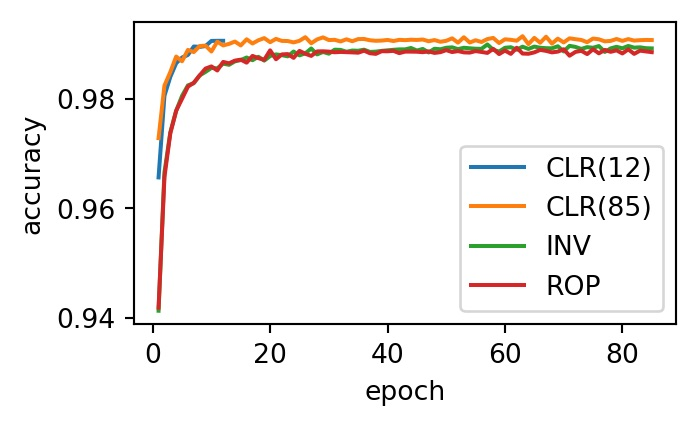
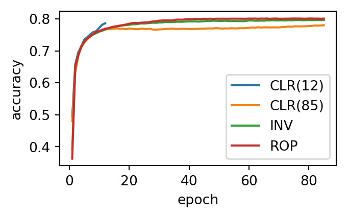

# Superconv

This repository provides an implementation of the *1cycle* learning rate policy as originally described in the paper: *Super-Convergence: Very Fast Training of Neural Networks Using Large Learning Rates* [1]. In addition, it includes a reproduction of the published results on MNIST and new experiments on CIFAR10.

What's in the box?

- [Implementation](https://github.com/coxy1989/superconv/blob/master/modules/callbacks.py) of the *1cycle* learning rate policy.
- [Port](https://github.com/coxy1989/superconv/blob/master/modules/model.py) of the *LeNet* model which ships with Caffe to keras.
- [Implementation](https://github.com/coxy1989/superconv/blob/master/modules/cifar10_model.py) of another simple 3 layer net.
- [Experiments](https://nbviewer.jupyter.org/github/coxy1989/superconv/tree/master/experiments/) which reproduce the published result on MNIST and new experiments on CIFAR10.

*The experiments performed in this repository were conducted on an Ubuntu 18.04 paperspace instance with a Nvidia Quadro P4000 GPU, NVIDIA Driver: 410.48, CUDA 10.0.130-1.*

## Quickstart

1. `git clone git@github.com:coxy1989/superconv.git`

2. `cd superconv` 

3. `conda env create -f environment.yml`

3. `source activate superconv`

4. `jupyter notebook`

*If you'd like to run the CIFAR10 experiments you can download the tfrecord files used in training from my website by running the get_data.sh script in the /data folder*

### Notebooks

- [Experiments](https://nbviewer.jupyter.org/github/coxy1989/superconv/tree/master/experiments/) - reproduce raw results.
- [Results](https://nbviewer.jupyter.org/github/coxy1989/superconv/blob/master/results/results.ipynb) - calculate run averages and plot figures.

## Results

### MNIST

The result below confirms that *superconvergence* can be observed with a standard configuration and the simple LeNet network architecture.

|  LR/SS/PL |  CM/SS | Epochs  | Accuracy (%)  |
|---|---|---|---|
| 0.01/inv  | 0.9  |  85 | 98.92  |
| 0.01/rop  | 0.9  |  85 | 98.85  | 
| **0.01-0.1/5**  | **0.95-0.8/5**  | **12**  | **99.05**  |
| 0.01-0.1/12  | 0.95-0.8/12  | 25  | 99.01  |
| 0.01-0.1/23  | 0.95-0.8/23  | 50  | 99.02  |
| 0.02-0.2/40  | 0.95-0.8/40  | 85  | 99.07  |

**Table 1**: Final accuracy for the MNIST dataset using the LeNet architecture with weight decay of `0.0005` and batch size of `512`. Reported final accuracy is an average of 5 runs. LR = learning rate, SS = stepsize in epochs, where two steps comprise a cycle. CM = cyclical momentum, 'inv' is the [inv](https://github.com/coxy1989/superconv/blob/master/modules/callbacks.py#L44) caffe policy, 'rop' is the [reduce on plateau](https://www.tensorflow.org/api_docs/python/tf/keras/callbacks/ReduceLROnPlateau) keras policy.

**Plot 1**: Accuracy vs epoch for the `CLR(12)`, `CLR(85)`, `INV` and `ROP` results in the preceeding table. 

### CIFAR10

Results on CIFAR10 were not included in the original paper. The result below demonstrates *superconvergence* is not observed with a standard configuration and simple 3 layer network. I suspect that tuning of the other hyperparamaters is required, since [it can be demonstrated](https://github.com/coxy1989/clr) that rapid convergence on this dataset is achievable with the related *CLR* policy and a similar network architecture. More experimentation is required here, feel free to send a pull request if you perform further experiments.

|  LR/SS/PL |  CM/SS | Epochs  | Accuracy (%)  |
|---|---|---|---|
| 0.01/inv  | 0.9  |  85 | 79.00  |
| 0.01/rop  | 0.9  |  85 | 80.11  | 
| 0.01-0.1/5  | 0.95-0.8/5  | 12  | 78.65  |
| 0.01-0.1/12  | 0.95-0.8/12  | 25  | 78.38  |
| 0.01-0.1/23  | 0.95-0.8/23  | 50  | 78.15  |
| 0.02-0.2/40  | 0.95-0.8/40  | 85  | 78.05  |

**Table 2**: Final accuracy on the CIFAR10 dataset with a simple 3 layer architecture, weight decay of `0.003` and batch size of `128`. Reported final accuracy is an average of 5 runs. LR = learning rate, SS = stepsize in epochs, where two steps comprise a cycle. CM = cyclical momentum, 'inv' is the [inv](https://github.com/coxy1989/superconv/blob/master/modules/callbacks.py#L44) caffe policy, 'rop' is the [reduce on plateau](https://www.tensorflow.org/api_docs/python/tf/keras/callbacks/ReduceLROnPlateau) keras policy.

**Plot 2**: Accuracy vs epoch for the `CLR(12)`, `CLR(85)`, `INV` and `ROP` results in the preceeding table. 

## References

[1] Leslie N. Smith. Super-Convergence: Very Fast Training of Neural Networks Using Large Learning Rates. [arXiv:1708.07120](https://arxiv.org/pdf/1708.07120.pdf), 2017.
